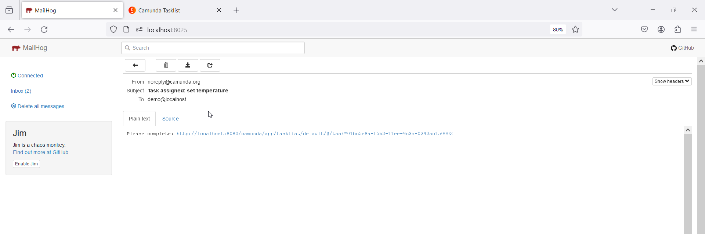

# Camunda Forms

A simple demo for a camunda form

See files [HERE](./camundaForm/)
- setTemperature.form : the form with one input
- set_temperature.bpmn : a simple model with a excusive gateway to check the input temperature from the form

**IMPORTANT** If you not able to interact with the form click on Clain

# Java 
## Introduction
This is a Java Spring Boot Demo Application as an example of integrating Camunda Forms and TaskListener within a Java Spring Boot framework. It automates a process that triggers an email to the logged-in user, asking them to set a temperature value. The process ends when the user submits the temperature value.

## Getting Started

To run the application:

1. Run`docker-compose up` inside demo-app.
2. Access the MailHog email server interface at [http://localhost:8025/](http://localhost:8025/).
3. Open the Camunda interface at [http://localhost:8080/camunda/](http://localhost:8080/camunda/).
4. Start the "Task Assignment Email" process within Camunda.
5. Check your email via MailHog .
6. Set the temperature value.

