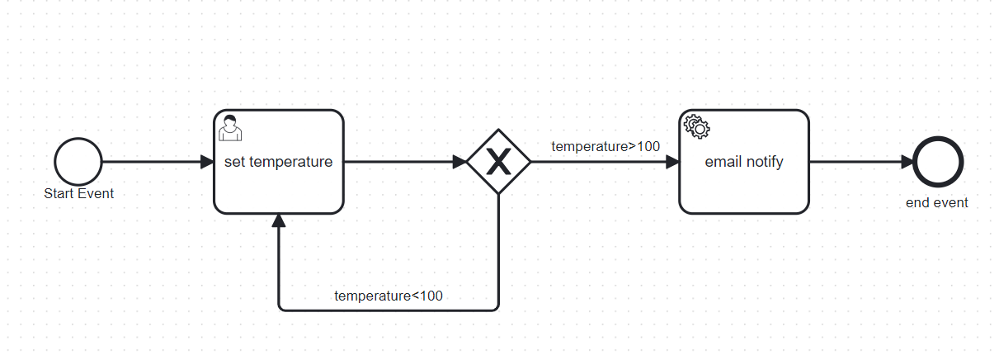
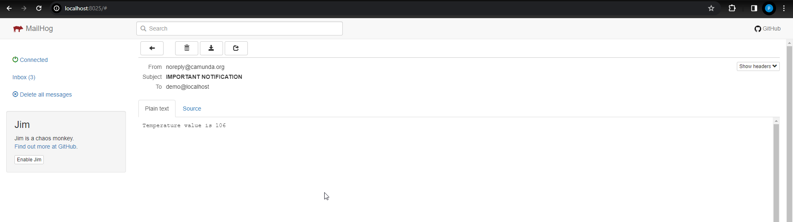

# Camunda Forms

A simple demo for a camunda form

See files [HERE](./camundaForm/)
- setTemperature.form : the form with one input
- set_temperature.bpmn : a simple model with a excusive gateway to check the input temperature from the form

**IMPORTANT** If you not able to interact with the form click on Clain

# Java 
## Introduction
This is a Java Spring Boot Demo Application as an example of integrating Camunda Forms and TaskListener within a Java Spring Boot framework.
At the beginning the user sets a temperature value through a user task.
If the temperature is above 100, the process triggers a service task that automatically sends an email notification to the user who submitted the temperature, informing them of the high temperature condition.

## Getting Started

To run the application:

1. Run`docker-compose up` inside demo-app.
2. Access the MailHog email server interface at [http://localhost:8025/](http://localhost:8025/).
3. Open the Camunda interface at [http://localhost:8080/camunda/](http://localhost:8080/camunda/).
4. Start the "Email Notification" process within Camunda.
5. Set the temperature value.
6. Check your email via MailHog for high temperature values.

## Demo Calculate weight
1. Run`docker-compose up` inside demo-app.
2. Access the MailHog email server interface at [http://localhost:8025/](http://localhost:8025/).
3. Open the Camunda interface at [http://localhost:8080/camunda/](http://localhost:8080/camunda/).
4. Start the "Weight In Kilos" process within Camunda.
5. Set the form values.
6. If you don't accept check again the values.
7. When you accept an email should send.
8. Process ends

